# Init everything 


In this step we will setup the tools we need to get started.
We will also deploy the scanner and se so that our basic setup is done and working 


### Install minikube
If you have not already done so install minkube and veridy your minikune is working.


https://minikube.sigs.k8s.io/docs/start/


## Deploy the Samma Operator and API


```
kubectl apply -f https://raw.githubusercontent.com/samma-io/operator/main/manifest/samma-operator.yaml
```

Verify thay are all running 

```
kubectl get all -n samma-io
```

NAME                                  READY   STATUS    RESTARTS   AGE
pod/samma-api-596d889f59-5vsh5        1/1     Running   0          2m57s
pod/samma-operator-6696dc4bcf-dr8c5   1/1     Running   0          2m57s

NAME          TYPE       CLUSTER-IP     EXTERNAL-IP   PORT(S)        AGE
service/api   NodePort   10.100.44.66   <none>        80:32153/TCP   2m57s

NAME                             READY   UP-TO-DATE   AVAILABLE   AGE
deployment.apps/samma-api        1/1     1            1           2m57s
deployment.apps/samma-operator   1/1     1            1           2m57s

NAME                                        DESIRED   CURRENT   READY   AGE
replicaset.apps/samma-api-596d889f59        1         1         1       2m57s
replicaset.apps/samma-operator-6696dc4bcf   1         1         1       2m57s
matte@hrb:~/projects/samma/guide$
```


## Deploy the samma tools
Wi will start with deploying the highground into our minikube cluster


```
kubectl apply -f 1-deploy/highground.yaml
```


## Verify that the tools are working

```
kubectl get all -n samma-io
```
Should look something like this

```
matte@hrb:~/projects/samma/guide/1-init/1-deploy$ kubectl get pods -n samma-io
NAME                              READY   STATUS    RESTARTS      AGE
NAME                                  READY   STATUS    RESTARTS   AGE
pod/elasticsearch-549fd86dfd-cskrz    1/1     Running   0          2m27s
pod/grafana-654f5bc67d-d8c55          1/1     Running   0          2m26s
pod/kibana-784b565464-6rtkg           1/1     Running   0          2m26s
pod/samma-api-596d889f59-5vsh5        1/1     Running   0          16m
pod/samma-operator-6696dc4bcf-dr8c5   1/1     Running   0          16m

NAME                       TYPE        CLUSTER-IP       EXTERNAL-IP   PORT(S)          AGE
service/api                NodePort    10.100.44.66     <none>        80:32153/TCP     16m
service/elasticsearch      ClusterIP   10.108.51.252    <none>        9200/TCP         2m26s
service/grafana            ClusterIP   10.101.156.196   <none>        3000/TCP         2m26s
service/grafana-nodeport   NodePort    10.102.23.210    <none>        3000:30425/TCP   2m26s
service/kibana             ClusterIP   10.104.219.48    <none>        5601/TCP         2m26s
service/kibana-nodeport    NodePort    10.111.244.239   <none>        5601:30897/TCP   2m26s

NAME                             READY   UP-TO-DATE   AVAILABLE   AGE
deployment.apps/elasticsearch    1/1     1            1           2m27s
deployment.apps/grafana          1/1     1            1           2m26s
deployment.apps/kibana           1/1     1            1           2m26s
deployment.apps/samma-api        1/1     1            1           16m
deployment.apps/samma-operator   1/1     1            1           16m

NAME                                        DESIRED   CURRENT   READY   AGE
replicaset.apps/elasticsearch-549fd86dfd    1         1         1       2m27s
replicaset.apps/grafana-654f5bc67d          1         1         1       2m26s
replicaset.apps/kibana-784b565464           1         1         1       2m26s
replicaset.apps/samma-api-596d889f59        1         1         1       16m
replicaset.apps/samma-operator-6696dc4bcf   1         1         1       16m
```

You should se our pods are in running state


## Get access to dashbourds
Lets list all the service 

```
matte@hrb:~/projects/samma/guide$ kubectl get svc -n samma-io
NAME               TYPE        CLUSTER-IP       EXTERNAL-IP   PORT(S)          AGE
api                NodePort    10.100.44.66     <none>        80:32153/TCP     19m
elasticsearch      ClusterIP   10.108.51.252    <none>        9200/TCP         5m22s
grafana            ClusterIP   10.101.156.196   <none>        3000/TCP         5m22s
grafana-nodeport   NodePort    10.102.23.210    <none>        3000:30425/TCP   5m22s
kibana             ClusterIP   10.104.219.48    <none>        5601/TCP         5m22s
kibana-nodeport    NodePort    10.111.244.239   <none>        5601:30897/TCP   5m22s
```
The service of TYPE NodePort aee the one we can connect in minikube lets open on up

When the pods are running we can get accees to the diffrent dashbourds lets start with grafana


```
 minikube service grafana-nodeport -n samma-io
```
This will open your browser and show the grafana. You can login with admin/admin and change the 

And to open the kibana dashbourd you type


```
 minikube service kibana-nodeport -n samma-io
```


## No persitant data
So have in mind this minikube and test has no data that will be saved. If the pods ore elasticsearch is killed all data will be gone.


## Adding the samma-io Dashbourd
To make graf easy samma.io has some base dashbourd that can be added. Today you need to login into the tools and add json file to setup the dashbourds.


### Setup Grafana

First open upp the grafana dashbourd it should be defualt load the dashbouard from grafana but if not this are the manual steps performed.

```
minikube service grafana-nodeport -n samma-io
```

## Check if the samma dashboard is loaded

If the dashbourd is not loaded performe the following steps

Login with admin/admin 

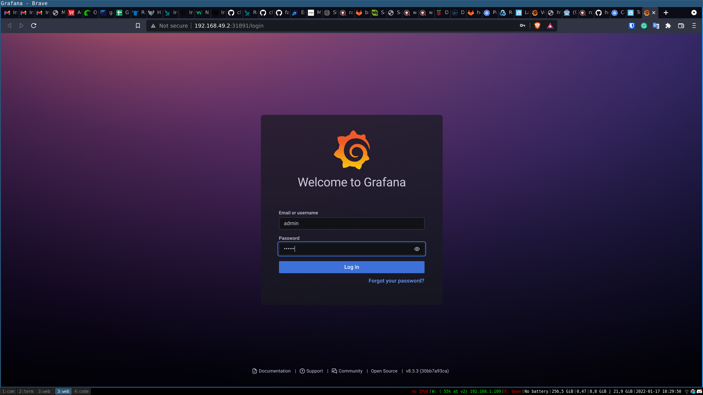
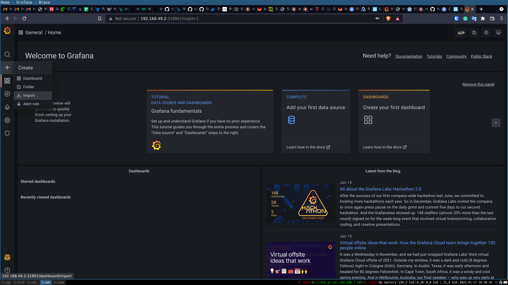
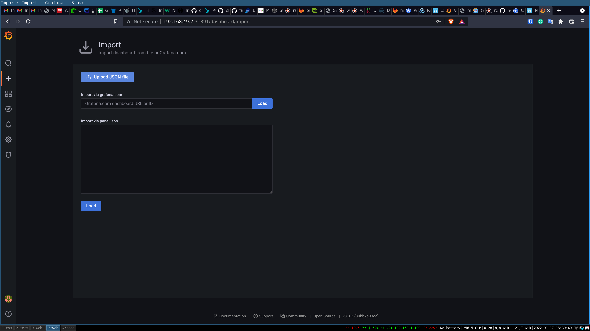
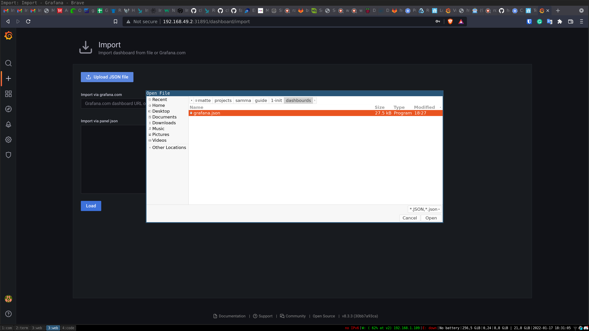
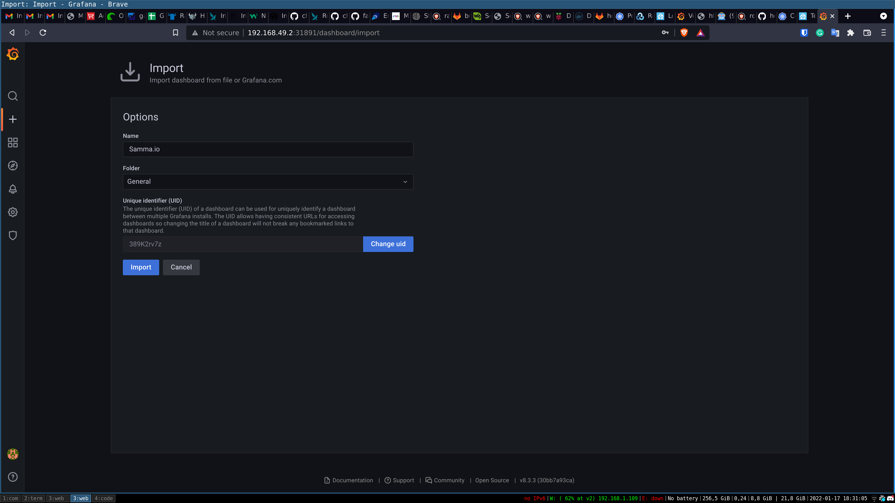
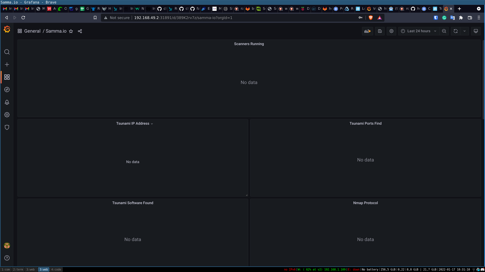


Now you the samma dashbourd are loaded for grafanna !


### Setup Kibana

Kibana we need to add the dashbouard manuall

First open the gui
```
minikube service kibana-nodeport -n samma-io
```

Then we can install our json that will setup the kibana dashbourds. They will make a error for we have not setup the index pattern but that will be resolved later when we start the scanner and they will send data to elastic


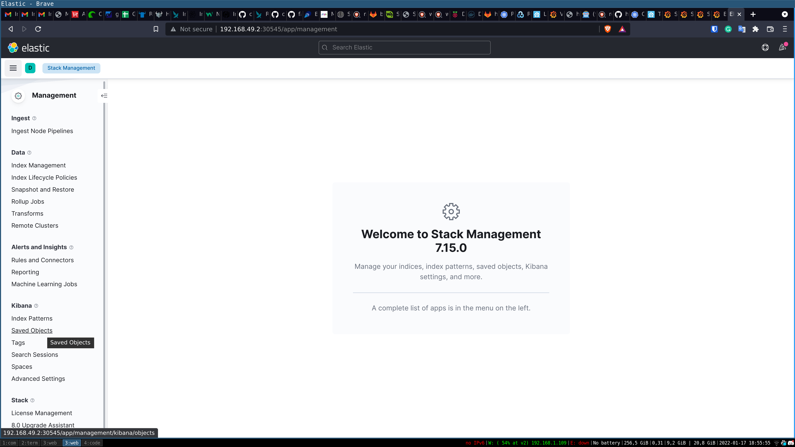
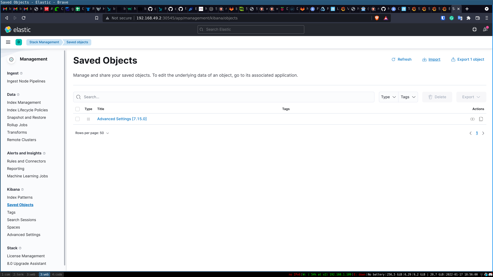

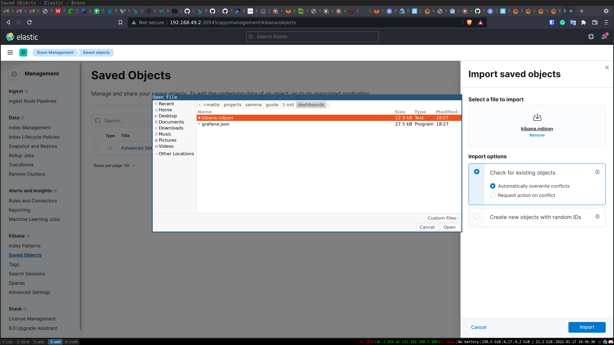
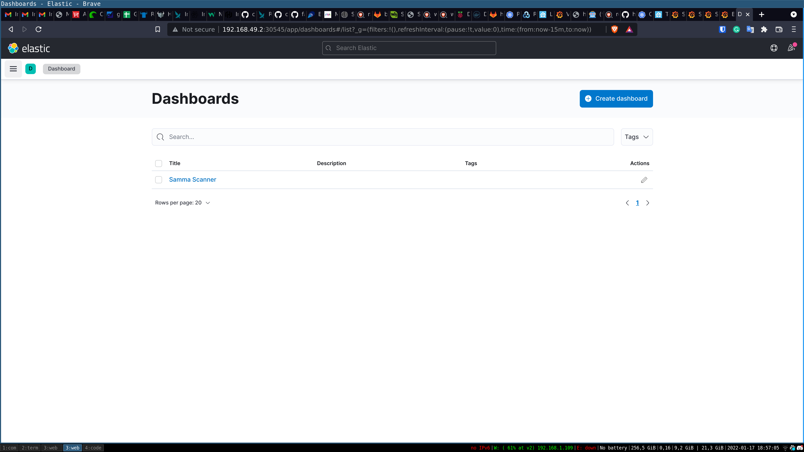
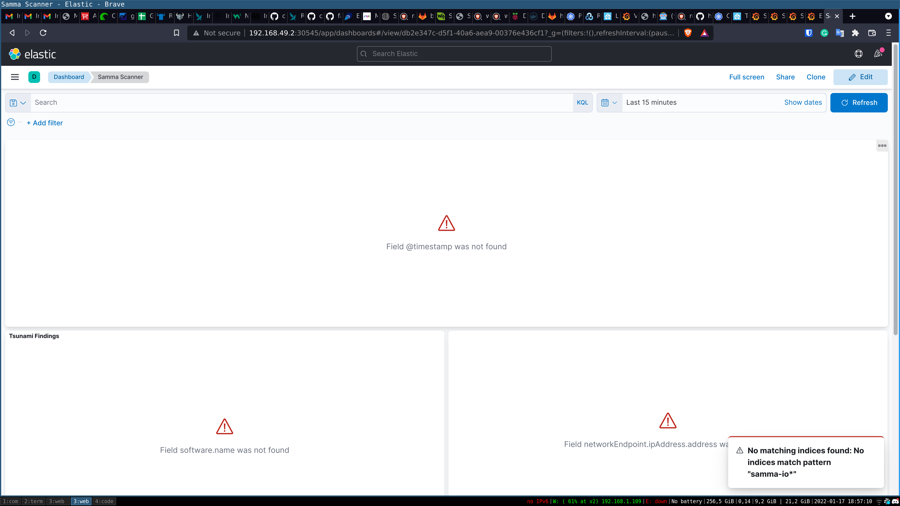


## Samma API

Load the samma api by


minikube service api -n samma-io

