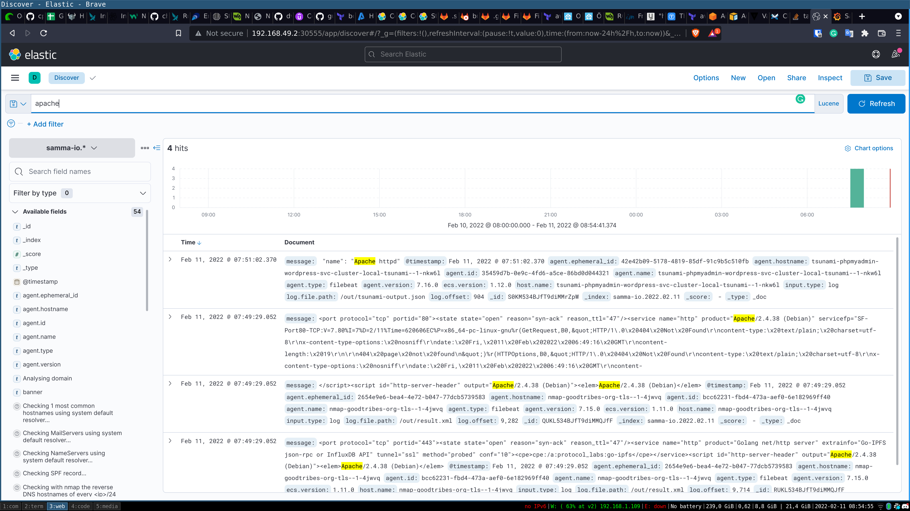
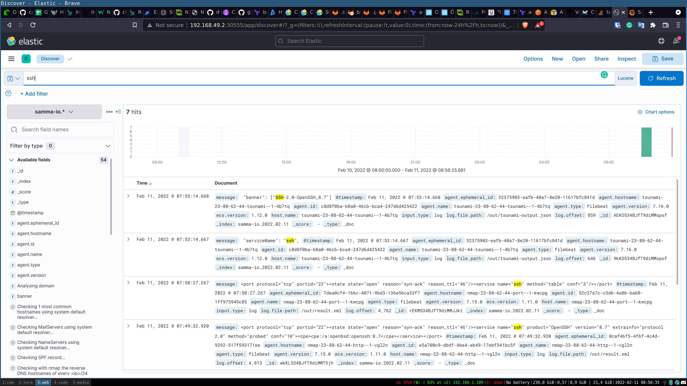
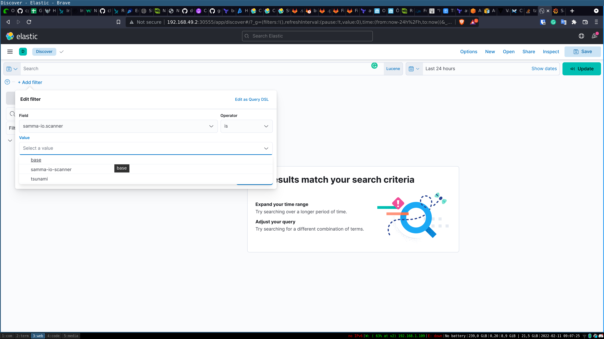
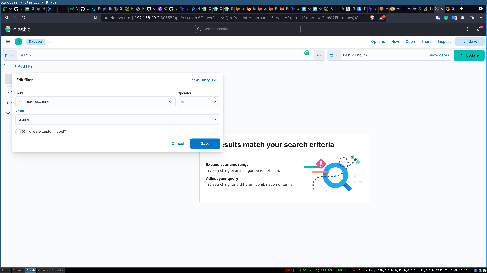
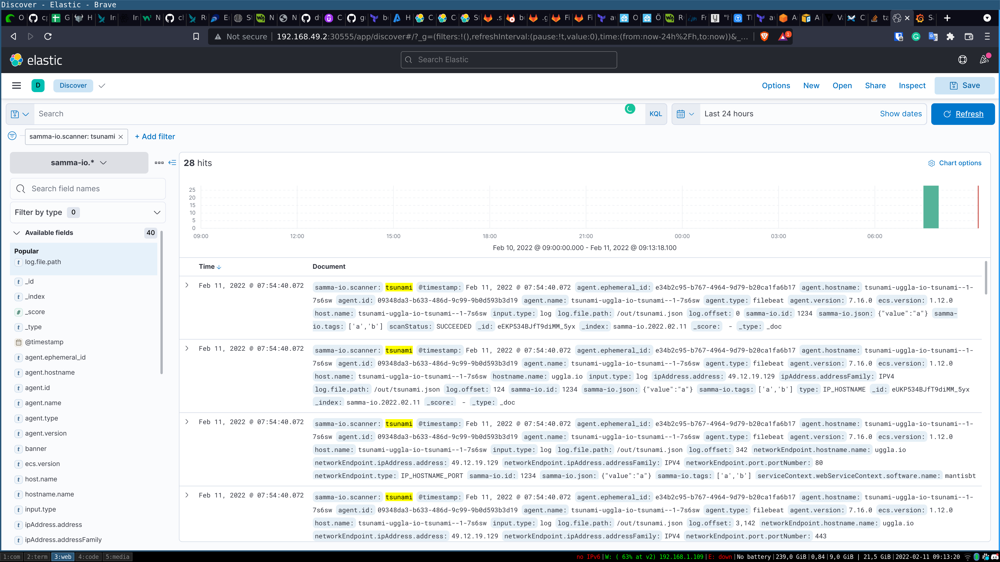
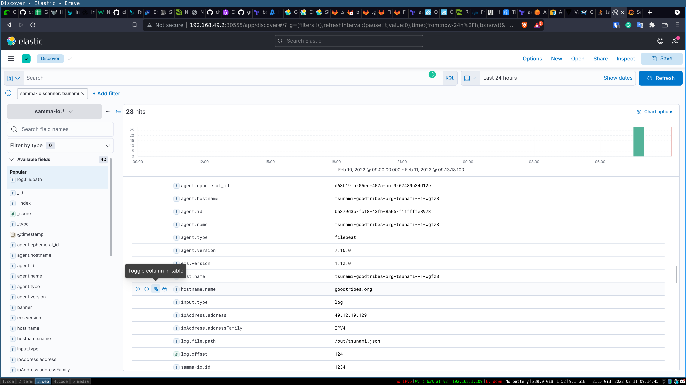
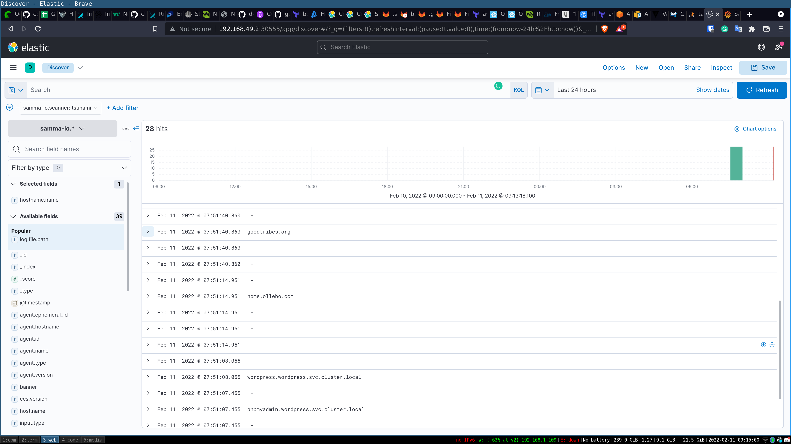
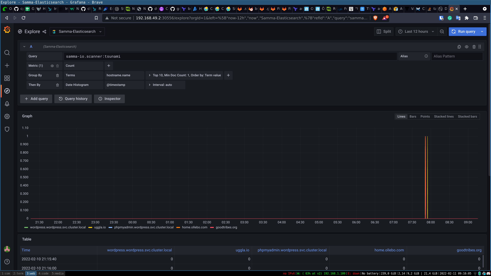
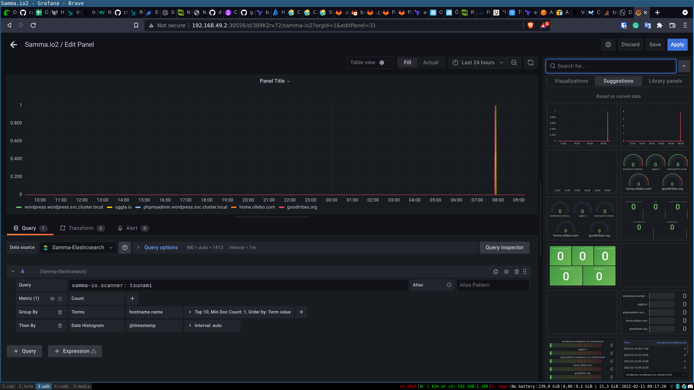
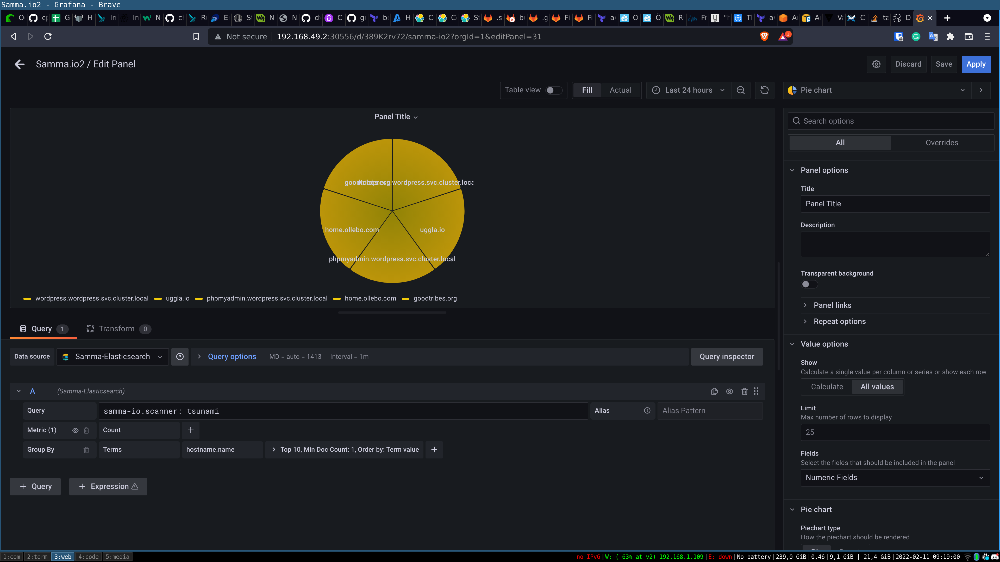

## Time to work with the dashbourd


## Grafana
Let's start looking at the Grafana dashboard. We use Grafan to get an overlook of the result of the scanners and to monitor 
if any new problems come up.

Samma provides a Grafana standard dashboard that we use as base and then modified.


Open the dashbourd in minikube


```
 minikube service samma -n samma-io
```
This will open tree taps fins the Grafana tab and login 

**user: samma password: samma-io**

Open the samma dashbourd in grafana


### Scanner scanners are based on time

One of the key values in Samma scanner are targat scan is based on time.
So all findings will only be shown for the time you have selected.

This means if you scan a target yesterday and then are looking at the result today, Then the finings of that target will not show.


Here is how you select hos to show the correct time frame.


### Lets make a new dashbourd
To make a new dashbourd let find some values that we like. Go to the *explore* page.
- Verify we are using the samma-elasticsearch datasource
- the timeframe are so we have targets.

First lets find all tsunami scanners


Know when we have the right scanners lets find all the ports the scanner did find.


We also have the port scanner nmap. So lets add all the ports that our nmap scanner did find.


Lets add this grafe to our samma.io dashbourd

- Open the dashboard
- Klick new "Add panel" (righ corner)
- Select "Add new panel"
- Verify the data source is "Samma-elasticsearch"
- Fill in the same values as before
- Save

And know we have success search for new values in the scan result and built a new graf.


To find more points of interest open the explorer tap and select different fields. 
(Grafana show all field in elastic and when we choose the scanner type example tsunami. Then there is only the fields from the tsunami scanner that will give any result.)


## Kibana
Kibana is used to search in the scanner result. You can search for Apache and find all result that where found with the Apacha webserver.
Before we can start using Kibana we need to setup a index pattern and mappings. This will help kibana when we search for values.
Itś good to to this after some scans have run so we always have a updated index pattern. If we add any new scanner that new scanner will add more fields and then we need to update the index mapping again.


### Lets setup kibana
- Go to stack manegment
- Kibana Index Pattern
- Create new 
- samma-io.* will find the samma.io index 
- Set time to @timestamp
- Go to Kibana discover and look at the result (check time)


### Lets find and sort findings

We can do fulltext search of text lets search for "Apache" to find all Apache servers running. Here we also cand fint the Apache version. We can also search for SSH to find all SSH server.








### Lets connect kibana finding to a Grafna graf
We can search for values in Kibana and then setip grafs in grafana to monitor the changes and findings.

First we need to soirt out the value we are intresting in. Then find the values we want to graf iun kibana. After that we can open grafana and query for that value and setup a dashbourd.

Here we are to filter out on tsunami scanner and find all the hostnames it finds.
Then make a grafs in grafana showing tha hostnames we are scanning.

We start by sorting the on tsunami scanner. Then in the result we show only to display the field we are intresting in.
And now we have some finding we can make a graf off.









So lets move to grafana and find the result we hade in kibana and then query for it. And then make a graf.







And you have now.

- Search in the scanner row data 
- Find a value that we want to monitor
- Setup a dashbourd in grafana that tracks this value


Lets move on to adding more targets and see the values change.