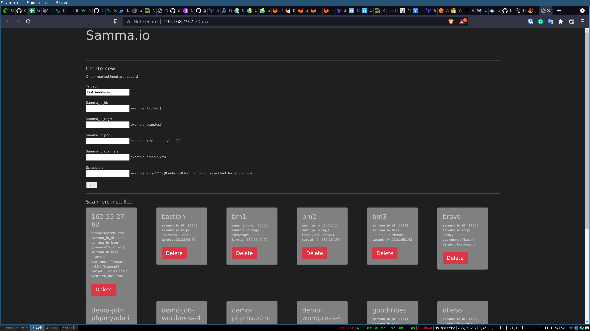

# Adding more targets

With Samma we can add targets in many different ways. All targets are saved in the Kubernetes cluster. 
So it does not matter how you add any targets to Samma.


## GUI
There is a simple gui that talks to the Samma API. To access run the following command in minikube

```
minikube service samma -n samma-io
```



From the gui you can add and delete targets


### New target

- Try to add a new target to the cluster to set the *Target* to "samma.io" and press add.
Verify the new target is shown in the list

- Add a new target that uses a other scanner set the *Target* to "ollebo.com" and *Samma_io_scanners* to base


## Yaml
It is easy to apply new target using a standard yaml file ass well. It's what the API and Ingress Operator does. They create scanner resources in the Kubernets Cluster.


Apply the following yaml to start a new scanner

```
apiVersion: samma.io/v1  
kind: Scanner
metadata: 
  name: samma-nmap-manual     
  namespace: samma-io
spec: 
 target: test.samma.io
 samma_io_id: "12345"
 samma_io_tags: 
      - scanner
      - prod
 write_to_file: "true"
 elasticsearch: elasticsearch
 scanners: ['nmap']
```


```
apiVersion: samma.io/v1  
kind: Scanner
metadata: 
  name: samma-nikto-manual     
  namespace: samma-io
spec: 
 target: test.samma.io
 samma_io_id: "12345"
 samma_io_tags: 
      - scanner
      - prod
 write_to_file: "true"
 elasticsearch: elasticsearch
 scanners: ['nikto']

```


## API (Curl)
You can also create targets with a curl command and this is great for scripting 


```
```


## Automaticly find ingress in kubernetes
The Samma Operator can also listen for Ingress in the kubernetes cluster and pick up any new ingress that are deployed and start scanners on them.


```
kind: Ingress
apiVersion: networking.k8s.io/v1
metadata:
  name: "samma-test"
  namespace: samma-io
  annotations:
    samma-io.alpha.kubernetes.io/enable: "true"
    samma-io.alpha.kubernetes.io/scanners: "nmap,nikto"
    samma-io.alpha.kubernetes.io/profile: "default"
    samma-io.alpha.kubernetes.io/scheduler: "2 19 * * *"
    samma-io.alpha.kubernetes.io/samma_io_id: "12345"
    samma-io.alpha.kubernetes.io/samma_io_tags: "scanner,prod"
    samma-io.alpha.kubernetes.io/write_to_file: "true"
    samma-io.alpha.kubernetes.io/elasticsearch: elasticsearch


spec:
  rules:
    - host: api.samma.io
      http:
        paths:
          - path: /
            pathType: Prefix
            backend:
              service:
                name: api
                port: 
                  number: 80
```

Apply the following yaml to deploy app into the cluster.


