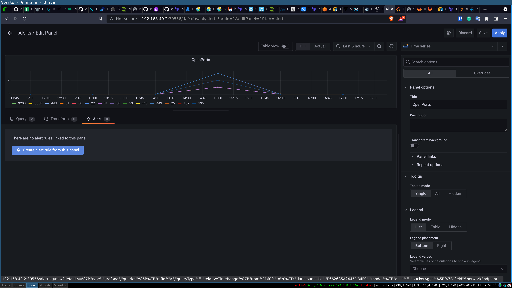

# Monitor the Delta
When we are running the our Samma scanner regular. 
We can setup alerts in grafana to monitor if something chnages. To do so we first run a scan to get our baseline. 
When we have our baseline we can set alerts if this changes.

In this example we have a simple baseline where we get alerted if new ports will bo open.
We set an alert to alert us if more than 3 open ports of the same port are open.

You can filter out ports ore calculate the sum in different ways to alert on more changes.

## Alert on changes in the Delta

### Tha graf
The first thing we need is a dashboard that tracks trends. In Grafana create a new dashboard (DONT USE THE ONE THAT WAS INSTALLED ITS READ ONLY)
And also create a new folder

Then create the same typ of graf we did before to find open ports

Add a Alert 

### Set what alerts 
Here we set the levels and what to happen. You can easily search and set different levels of alert to get as close as possible to your baseline.

