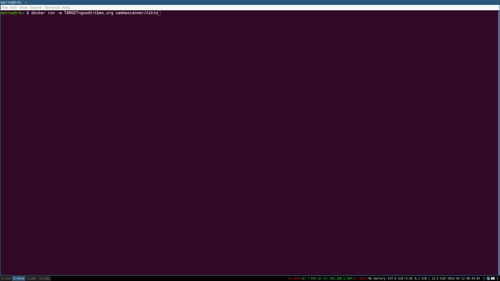
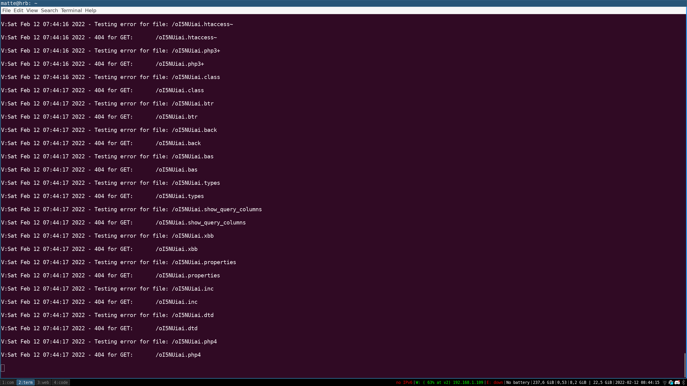
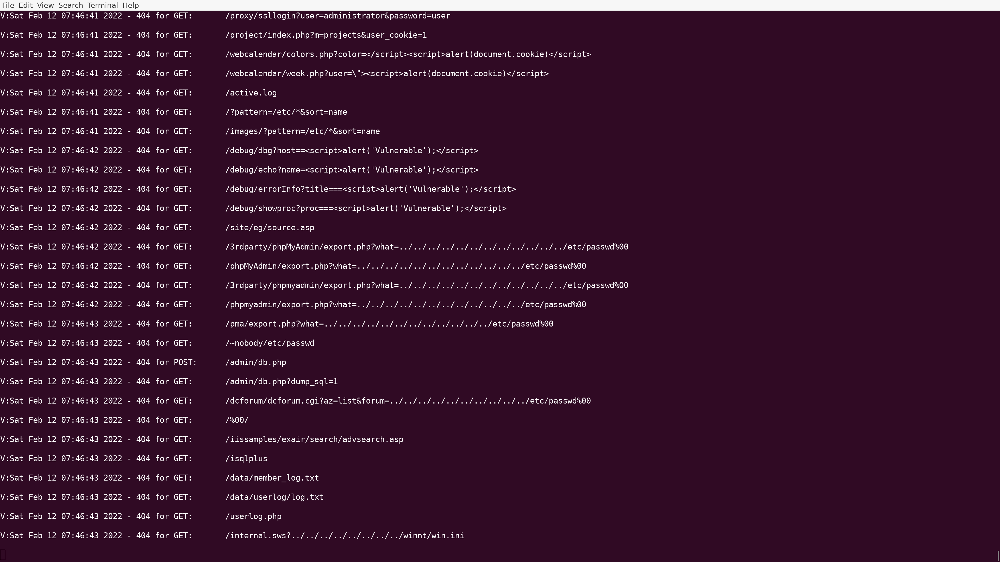
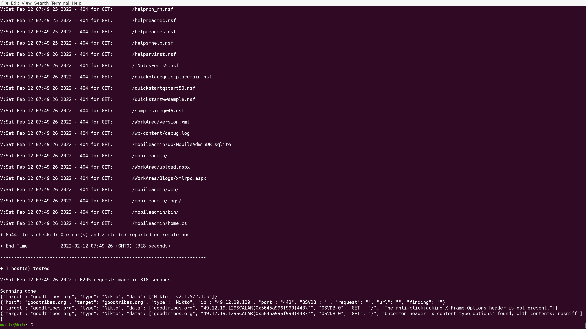

# Localscanner

One if the key fetures of the scanners use in samma is that they should be easy to run for developers and tester.
So when a scanner has found any issues, The issues can be fixed, And a scanner can then be run to verify the fix.


## Req
To run any of the Samma scanners you need to have docker installed or a server that has docker installed.


## All Scanner are local first


all of the scanners can be launched with a simple docker command here are some to test


```
docker run -e TARGET=test.samma.io sammascanner/tsunami 
```


```
docker run -e TARGET=test.samma.io sammascanner/nmap 

```


```
docker run -e TARGET=test.samma.io sammascanner/nikto 
```

```
docker run -e TARGET=samma.io sammascanner/base 
```








The scanner can generate a lot of data into stout. A simple grep can be added to find relevant values.


